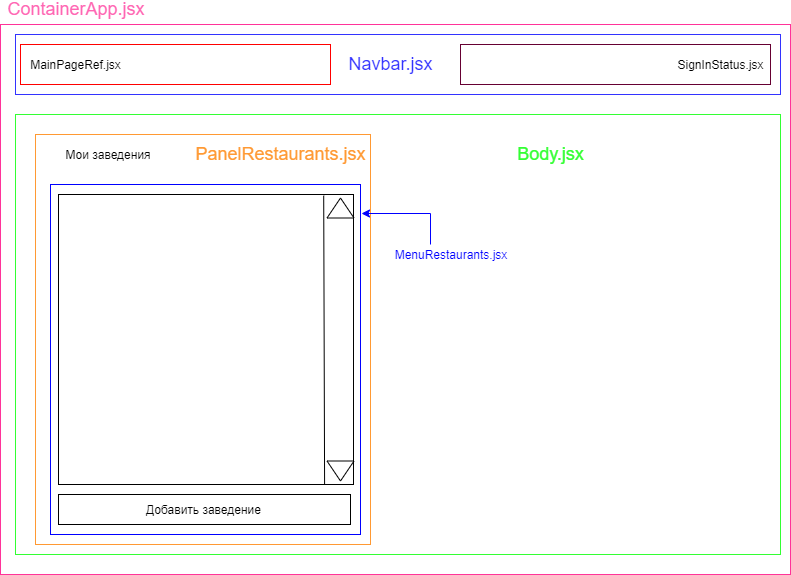

# Задание #2

## Как всё работает

### Запуск приложения

Приложение также запускается через следующую команду в терминале: `npm start`
Программа перенаправит вас на путь `http://localhost:3000/owner/places`. Это нормально, т.к. это было сделано в рамках задания

### В схемах

На данной схеме приведено наглядное отображение архитектуры данного приложения. Приведены все компоненты в соответствии с их расположением на странице

### Файловая структура

Файловая структура создана в соответствии с [этой](https://medium.com/@Charles_Stover/optimal-file-structure-for-react-applications-f3e35ad0a145) статьёй. Ну или по крайней мере мне так кажется :'(

### Методология

В данном приложении используется методология БЭМ. Каждому блоку и элементу дано название класса, а также название и статус модификатора

### Замечание

> Графический интерфейс построен на фреймворке `Semantic-UI`
>
> При стилизации отдельных компонентов был использован подход `CSS in JS`. CSS препоцессоры в данном задании использованы не были, > т.к. задание того не требовало

